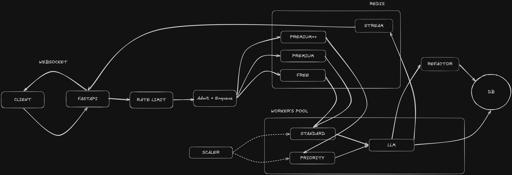

# Wave

**Wave** is an AI companion chatbot with subscription tiers (`free`, `premium`, `premium++`),
built on FastAPI + PostgreSQL + Redis, using OpenAI GPT for replies (without an API key a mock
client runs everything offline).

## Architecture (High-Level Design)



## Quickstart

```bash
docker compose up -d --build --scale worker=3
```

- Starts `api`, `manager` (autoscaler), `reflector`, and N `worker`s.
- The schema is created automatically (`migrate` one-shot). To chat, seed users yourself: `docker compose run --rm api python -m scripts.seed`.
- Chat: open `ws://127.0.0.1:8000/ws/chat?user_id=<id>`, send `{"message": "..."}`, get `token` frames then `done`.
- Check live state at `GET /metrics`, health at `GET /healthz`.

---

## Part 1 — Data model

Four tables: `users` ─1:1─ `personalities`, `users` ─1:N─ `sessions` ─1:N─ `messages`.

- A **session** is one conversation; a user has **at most one active session** at a time.
- `tier` is a **real column**, not JSON — so it can be indexed and grouped on cheaply.
- `messages` stores its own `user_id` and `tier`, so common reads don't need joins.
- **One personality per user**, updated in place.
- UUID keys, UTC timestamps everywhere.
- Indexes match the real queries: active session, recent messages, active users by tier.

Details: **[docs/data-model.md](docs/data-model.md)**.

## Part 2 — Tier-aware load balancer

- **Pull-based**: the hot path is 1 Redis op to enqueue + 1 `BZPOPMIN` to dequeue — no central dispatcher.
- **Three lanes** (`ent > prem > free`), served in priority order so higher tiers go first.
- **Three worker pools**: `priority` (enterprise only), `standard` (always on), `overflow` (elastic).
- **One pressure signal (0–3)** combines load, latency, and health, and drives everything.
- Autoscaler grows/shrinks `overflow` within a single worker budget (`W_MAX`).
- Under load, **lowest tier degrades first**; **enterprise never degrades or gets dropped**.
- A small fairness chance keeps the `free` lane from ever starving.

Details: **[docs/load-balancer.md](docs/load-balancer.md)**.

## Part 3 — Rate limiting & safety

- Per-user **token-bucket** rate limit, done in one Redis op.
- Over the limit → Wave says **one warm line, then stays quiet** (never spams).
- Near the limit → one gentle heads-up, still answered.
- **Per-IP guard** on connect to stop floods and fake users.
- Safety is **model-driven**: the model tags each reply (`jailbreak` / `nsfw` / `boundary` / `crisis`) and Wave responds in character — **no keyword regex**.
- A **crisis message gets a caring reply**, not a refusal.

Details: **[docs/safety-rate-limiting.md](docs/safety-rate-limiting.md)**.

## Part 4 — Observability

- Analytics never block the chat: `track()` just drops an event on a queue; a background task flushes to Redis.
- Under pressure, low-value events are dropped first; important ones always kept.
- **JSON logs** with a correlation id (`message_id`) on every line, so one chat is traceable across `api` and `worker`.
- Timeline `received → enqueued → dequeued → first_token → completed → delivered` shows where time goes.
- **Graceful shutdown**: analytics and logs flush on exit, nothing is lost.

Details: **[docs/observability.md](docs/observability.md)**.

## Part 5 — Personality reflection

- When a chat goes idle, a **reaper** closes the session and queues it for reflection (off the chat path).
- A background LLM pass updates the user's **traits** and **summary** from the conversation.
- Traits are **blended slowly** toward the new read, so one odd chat can't swing the persona.
- **Bad model output never corrupts** the personality — it only writes after a clean parse.

Details: **[docs/reflection.md](docs/reflection.md)**.
